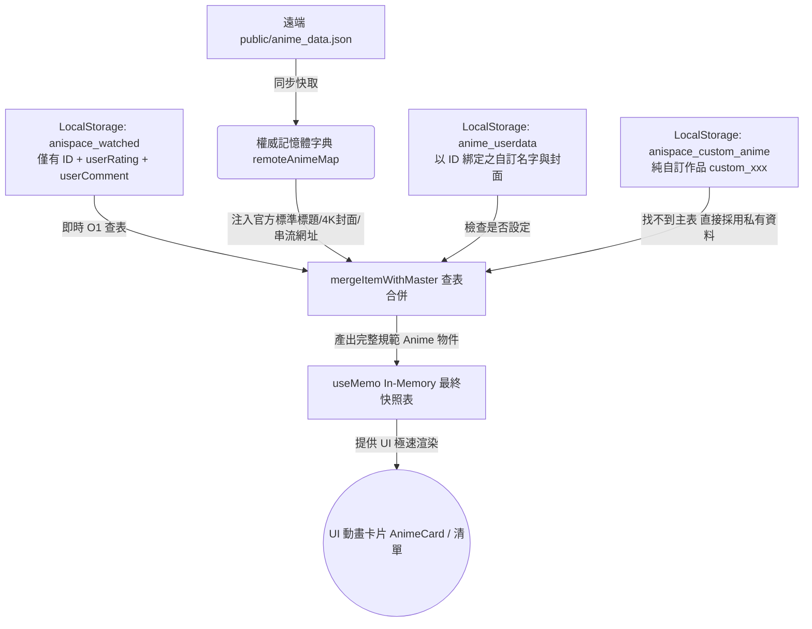

# AniSpace 系統架構與資料流規範 (System Architecture & Data Flow)

> [!IMPORTANT]
> 本文件詳述 AniSpace 當前的前後端資料儲存、正規化關聯設計、優先級覆蓋邏輯與畫面即時渲染流向。日後新功能的開發或資料結構重構，皆需遵循此文檔所定義之原則。

---

## 1. 靜態與遠端權威資料來源 (Master Data Sources)

系統的客觀基礎資料由以下檔案維護：

### 1.1 `public/anime_data.json` (官方權威總表)
- **定位**：全站所有動畫的「單一真理來源 (Single Source of Truth)」。
- **收錄內容**：每部作品的唯一永久識別碼 `id` (`anilist-xxx`)、標準繁體中文官方正譯 `titleZh`、日文 `titleJa`、英文 `titleEn`、4K 高畫質封面 `coverImage`、開播/完結日期、播放季度 `yearSeason`、分類標籤 `genres` 以及各合法授權 OTT 播放平台清單 `streamings`。
- **更新週期**：由後端每日定時執行爬蟲腳本（或 GitHub Actions 自動構建）從外部資料源（Bangumi / MyAnimeList / AniList）抓取更新。

### 1.2 `public/custom_override.json` (人工介入補綴表)
- **定位**：用以修正外部資料庫簡體字、港澳譯名落差或錯誤資訊的人工修正表。
- **運作**：記載 `{ id: "anilist-xxx", titleZh: "規範譯名", source: "manual" }`。爬蟲腳本運作時會讀取此表，針對 `source: "manual"` 的項目進行最高順位鎖定，絕不被自動化爬蟲覆蓋。

---

## 2. 使用者端 LocalStorage 輕量關聯生態 (User LocalStorage Ecosystem)

為達到**極致輕量儲存**與**前後向完全相容**，使用者的瀏覽器 `localStorage` 中維護以下結構，全面採取正規化（Normalization）設計：

| LocalStorage Key | 系統常數名稱 | 資料結構範例與用途 |
|---|---|---|
| **`anispace_cached_data`** | `CACHED_DATA_KEY` | **官方總表快取**。存放下載的 `anime_data.json`，確保下次開啟網頁第 0 毫秒極速載入，無延遲閃爍。 |
| **`anispace_watched`** | `LOCAL_STORAGE_KEY` | **動畫紀錄 (Watched List)**。僅存輕量 ID 與個人評價 delta： `[ { "id": "anilist-185", "userRating": 10, "userComment": "神作！", "watchedDate": "2025-03-12" } ]` *不重複儲存標題、封面與播放網址，省下 80%+ 空間。* |
| **`anispace_plan_to_watch`** | `PLAN_TO_WATCH_KEY` | **期待清單 (Watchlist)**。輕量化紀錄，僅存 `id`。 |
| **`anime_userdata`** | `USER_DATA_KEY` | **個人專屬自訂資料庫 (Custom User Overrides)**。集中管理使用者對特定作品自訂的名稱與封面 URL，以動畫 `id` 為主鍵 (Key)： `{ "anilist-185": { "customTitle": "極速飆車頭文字D", "customCover": "https://..." } }` |
| **`anispace_custom_anime`** | `CUSTOM_ANIME_KEY` | **純手動自訂作品庫**。收錄官方資料庫未收錄、完全由使用者純手動建立的私有作品（ID 統一為 `custom_時間戳`）。 |

---

## 3. 資料查表渲染管道 (Hydration & Data Pipeline)

React 前端在載入與渲染卡片時，採用「**記憶化查表合併 (`mergeItemWithMaster`)**」機制：

---

## 4. 優先級與覆蓋規則 (Priority Hierarchy)

當系統渲染任意一部動畫卡片或清單時，屬性展示嚴格遵循以下順序（由高至低）：

1. **👑 第 1 順位 (最高優先)：使用者私有設定 (`anime_userdata`)**
   - 只要使用者在 UI 上修改過某作品的名字或封面，該屬性會綁定 ID 記錄在 `anime_userdata`。畫面渲染時優先展示使用者的專屬命名與封面！
2. **🥈 第 2 順位：使用者純手動新增作品 (`anispace_custom_anime`)**
   - 針對 `custom_` 開頭的作品，因官方庫無收錄，100% 呈現使用者建立時填寫的資料。
3. **🥉 第 3 順位：團隊人工維護修正 (`custom_override.json`)**
   - 官方庫內作品若遇外部 API 翻譯瑕疵，由人工覆蓋表確保繁體中文品質。
4. **🛡️ 第 4 順位 (授權基底)：官方主表 (`anime_data.json`)**
   - 作為單一真理來源，提供高畫質封面、放送年度與巴哈姆特動畫瘋等合法播放連結。

---

## 5. 相容性與升級策略 (Backward Compatibility)

- **舊有個人紀錄相容**：即使舊用戶 localStorage 內仍殘留過往的全包快照舊資料，`mergeItemWithMaster` 僅會安全提取其評語與評分，並將標題自動對準最新主表。隨後的存檔操作會自動將舊資料洗淨瘦身為新版輕量 JSON。
- **舊有譯名相容**：若舊用戶持有以舊字串為 Key 的修正字典，系統讀取時提供雙軌相容（向後比對字串），並於編輯時自動綁定為規範 ID 結構。
